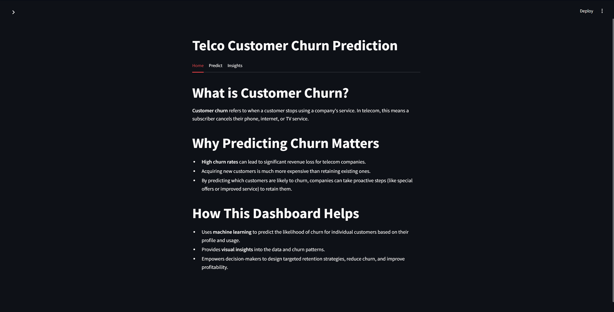

# Telco Customer Churn Prediction Dashboard

[](https://github.com/yourusername/your-repo)
[](LICENSE)


## Description
A user-friendly dashboard for predicting customer churn in the telecom industry, built with Python, Streamlit, and scikit-learn. The app enables business users to visualize churn patterns, predict churn risk for individual customers, and generate actionable insights to improve retention.

## Objective
- Predict whether a customer is likely to leave the telecom company (churn)
- Provide visual and data-driven insights to help management reduce churn

## Dataset Information
- **Source:** [Telco Customer Churn Dataset on Kaggle](https://www.kaggle.com/blastchar/telco-customer-churn)
- Contains customer demographics, account information, service usage, and churn status

## Features and Tech Stack
- **Python 3.8+**
- **Streamlit** for interactive dashboards
- **scikit-learn** for machine learning
- **pandas, numpy** for data processing
- **seaborn, matplotlib, plotly** for data visualization
- **joblib** for model persistence
- **fpdf** for PDF report generation

## Installation and Setup
1. Clone this repository:
   ```bash
   git clone <repo-url>
   cd TELCO-Customer_Churn
   ```
2. Create and activate a virtual environment (optional but recommended):
   ```bash
   python -m venv .venv
   .venv\Scripts\activate  # On Windows
   source .venv/bin/activate  # On Mac/Linux
   ```
3. Install dependencies:
   ```bash
   pip install -r requirements.txt
   ```
4. Download the Telco Customer Churn dataset from Kaggle and place it in the project folder as `telco_churn.csv`.

## How to Run the Streamlit App
```bash
streamlit run streamlit_app.py
```
The app will open in your browser at [http://localhost:8501](http://localhost:8501).

## Screenshots



## Model Performance Metrics
- **Accuracy:** ~80%
- **F1 Score:** ~0.78
- **Precision/Recall:** See classification report in the app

## Key Business Insights
- The company is losing **26% of customers** due to short contracts and high bills.
- Customers on month-to-month contracts and with higher monthly charges are most at risk.
- Offering bundled packages and incentives for longer contracts can help increase tenure and reduce churn.

## Learnings
- Hands-on experience with end-to-end machine learning projects
- Building interactive dashboards with Streamlit
- Data preprocessing, feature engineering, and model evaluation
- Communicating business insights from data

## Author
- **Your Name**  
  [LinkedIn](https://www.linkedin.com/) | [GitHub](https://github.com/)

## License
This project is licensed under the MIT License.
